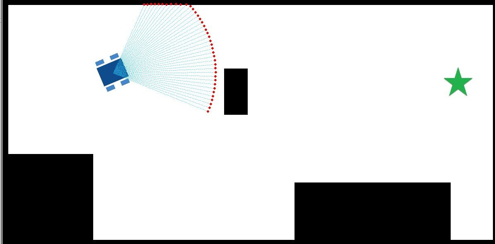

# Differential Drive Robot 

This is a repository for creating a differential drive robot with simulated lidar

Examples include a naive obstacle avoidance and a reinforcement learning method for training the robot to go to goal while avoiding obstacles

## Installation

Clone repository using git clone https://github.com/laurenbramblett/robot_DFD_RL.git

Install the python requirements txt located in the main folder 

```bash
pip install -r /path/to/requirements.txt
```

## Usage

* Running "main_robot_DFD.py" will run a naive obstacle avoidance robot that wanders the map
* Running "main_robot_RL_DQN.py" (in Archive/) will train a DQN on a .npy. You can change the map and various configurations by changing the env_configs
* Running "LoadTrainedModel.py" (in Archive/) will load pre-trained models from the subfolder "data"
* Running "rllib_robot_main.py" (in Archive/) will allow running the model on Ray which uses state of the art RL agents to train the model
** Results can be visualized locally using tensorboard with the below command:
```bash
tensorboard --logdir user_path/to/ray_resultsFolder
```

* Running "main_robot_simulateObs" will allow you either randomly wander and generate data or use keyboard arrows to move the robot through the environment and capture potential field data based on observations
* Running "main_robot_simulateObs_Unif" will randomly sample the given environment for gradient potential data 

Below is a picture of the robot in action:

